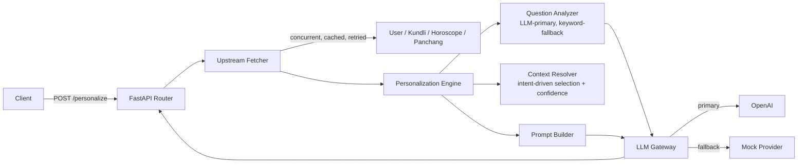

# Personalized AI Context Engine

The intelligence layer between structured astrological backend
services (User, Kundli, Horoscope, Panchang) and an LLM: it detects intent,
selects only the relevant context, personalizes language/tone/length, and
generates a grounded, sourced answer.

This README covers architecture, running it, assumptions, and trade-offs.

## Architecture



Layering:

| Package | Responsibility |
|---|---|
| `src/api` | HTTP layer - request/response shaping only |
| `src/clients` | Upstream service communication (fetch, retry, cache) |
| `src/config` | Loads the three config tiers (env, business rules, prompts) |
| `src/engine` | Intent analysis, context resolution, personalization, prompt building |
| `src/llm` | Provider abstraction + resilient gateway |
| `src/models` | Public API contracts, kept separate from internal engine types |
| `mocks/` | Standalone mock implementations of the four upstream services |

## Running it

### Option A: Docker Compose (recommended - no local Python setup needed)

```bash
docker compose up --build
```

This starts all four mock services plus the engine. The engine is then
reachable at `http://localhost:8000`. To use a real OpenAI key, export it
before starting: `export OPENAI_API_KEY=sk-...`. Without one, the gateway
automatically falls back to a deterministic mock provider - the service is
fully runnable with zero external dependencies.

### Option B: Local Python

```bash
python3.12 -m venv .venv && source .venv/bin/activate
pip install -r requirements.txt
cp .env.example .env

# in four separate terminals
uvicorn mocks.user_service.main:app --port 9101
uvicorn mocks.kundli_service.main:app --port 9102
uvicorn mocks.horoscope_service.main:app --port 9103
uvicorn mocks.panchang_service.main:app --port 9104

# and the engine itself
uvicorn src.main:app --port 8000
```

### Try it

```bash
curl -X POST http://localhost:8000/personalize \
  -H "Content-Type: application/json" \
  -d '{"userId": "user_101", "question": "Should I consider changing my job in the next few months?"}'

curl -X POST http://localhost:8000/debug/personalization \
  -H "Content-Type: application/json" \
  -d '{"userId": "user_101", "question": "Should I consider changing my job in the next few months?"}'
```

### Tests

```bash
pytest
```

35 tests across analyzer (intent/language/tone detection), context
resolution, degradation, LLM fallback, upstream fetcher (retry/cache), and
the API layer.

## Assumptions

- **Unknown `userId`s are served the sample fixture, not a 404.** Only one
  sample user is available; the mocks return that same fixture (with the
  id swapped in) for any `userId` so the engine's behavior never depends
  on a specific id existing.
- **No OpenAI key is required to run this.** The gateway detects a missing
  key and falls back to the mock provider automatically - a key only
  changes which provider answers, not whether the service works.
- **The question is assumed to already be well-formed** - the engine
  personalizes and answers it as given, but doesn't refine it first. A
  refinement step (e.g. resolving what "it" or "this" refers to from
  prior conversation, rephrasing an ambiguous or garbled question,
  inferring missing context) is treated as a separate, upstream concern
  and out of scope here.

## Trade-offs

1. **LLM-primary intent classification, keyword fallback** - the LLM
   understands free-form phrasing; keyword rules only exist so the request
   still resolves an intent if the classification call fails.
2. **Configuration-driven context selection** over hardcoded `if/else` -
   adding an intent is a YAML entry, not a code change.
3. **Graceful degradation over hard failure** - a failed upstream service
   lowers confidence and swaps in fallback context rather than erroring.
4. **One real LLM provider (OpenAI) + mock**, behind a swappable
   `BaseLLMProvider` interface, instead of wiring multiple real providers
   that would add little architectural signal over the first one.
5. **In-memory TTL cache** instead of Redis - no external infra needed to
   run this, at the cost of the cache being per-process.

## What was intentionally simplified

- **Confidence is a function of data availability only**, not of which LLM
  provider ultimately answered (mock vs. OpenAI) - keeps the two concerns
  independent and testable.
- **No token-budget optimizer.** Context selection is the configured
  primary/secondary/degraded lists as-is; there's no knapsack-style
  allocator trimming context under a token limit.
- **No circuit breaker.** The gateway retries and falls back per-request;
  it doesn't track provider health across requests to short-circuit a
  known-down provider.
- **Coarse-grained latency logging.** Fetch/engine/LLM stages are timed;
  intent-classification vs. context-resolution are timed separately inside
  the engine but only logged at DEBUG level, not surfaced per-request in
  the API response.

## What I'd improve with another day

- Add Anthropic/Groq as additional fallback providers - `BaseLLMProvider`
  already supports this with zero engine changes, just new provider
  classes and `llm_config.yaml` entries.
- A weighted token-budget allocator for context selection when prompts
  grow large, instead of always sending the full configured primary +
  secondary set.
- A circuit breaker in the LLM gateway to stop hammering a provider that's
  already down for the last N requests.
- Structured (JSON-schema-validated) LLM outputs instead of parsing
  `Follow-up: ...` out of free text.
- Property-based tests for the dot-path context resolver against
  arbitrarily-shaped fetch payloads.
- An A/B experimentation framework for prompts and other personalization
  options (e.g. trialing alternate system prompts, tone/context-selection
  strategies) with outcome tracking, instead of a single fixed
  configuration for everyone.

## Production concerns left out of scope

Rate limiting/tenant throttling, distributed tracing, PII redaction before
sending birth details to a third-party LLM, distributed (Redis) caching,
multi-region deployment, and authentication/authorization are all
deliberately left out of this scope.
